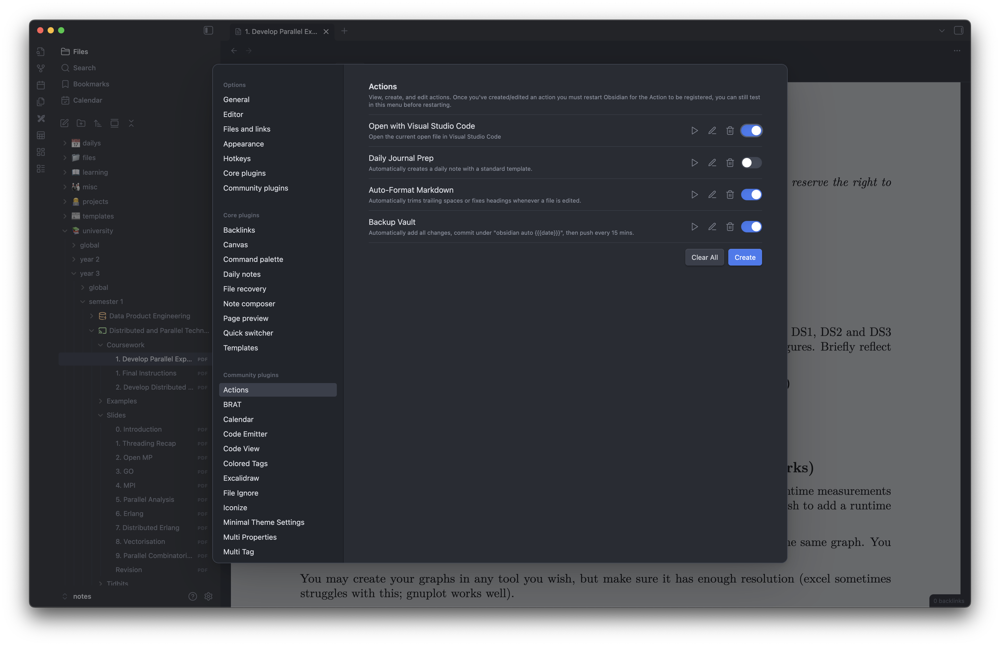

<p align="center">
  
</p>

<p align="center">
  <a href="https://obsidian.md">
    
  </a>
</p>

# Obsidian Actions

**Actions** is an Obsidian plugin that allows you to define custom `shell` or `javascript` actions which are then triggered by a variety of hooks. These actions can manipulate files, execute scripts, or automate workflows inside your Obsidian vault.

I designed it to be as flexible as possible, exposing a controlled environment of variables and methods to help you template your scripts.

## Features

- define manual, startup, event-based, or interval-based actions.
- support for both `javascript` and `shell` commands.
- use template variables to dynamically access file and editor context.
- supports `cron` styled scheduled actions with interval hooks.

## Installing

**If you are manually installing the plugin**:

- copy `main.js`, `styles.css`, and `manifest.json` into `[your_vault_folder]/.obsidian/plugins/actions`
- enable the plugin from Obsidian settings → Community Plugins → Actions Plugin.

**If you are developing**:

- clone the repo
- install dependencies, `npm ci`, if you are ever to add new dependencies please always lock the version, the days of `^` are long gone.
- create a symlink from your plugin folder to your obsidian vault.
  - on macOS / Linux `ln -s /full/path/to/your/repo /full/path/to/your/vault/.obsidian/plugins/actions-plugin`
- start watch mode to compile TypeScript automatically `npm run dev`
- then enable the plugin in Obsidian and you should see your changes reflected.

## Using the Plugin

- open Settings -> Actions.
- create a new action using the Create button.
- configure the action:
  - `name`, displayed in the ui and used to generate the action id.
  - `icon`, choose any [Lucide](https://lucide.dev/icons/) icon
  - `description`, optional description shown in settings.
  - `hook`, determines when the action runs; `manual`, `startup`, `interval`, or on `events`.
  - `type`, `js` or `shell`.
  - `code`, the command or script to execute.
  - `schedule`, required if using an interval hook, in `cron` format.
- save the action. You can now execute it manually or wait for its hook trigger.

## Wanna know more about the Plugin?

### Hooks?

Hooks determine when your action runs:


| Hook         | Description                                                                |
| ------------ | -------------------------------------------------------------------------- |
| `manual`     | Executes only when manually triggered via the settings or command palette. |
| `startup`    | Executes automatically when Obsidian loads.                                |
| `interval`   | Executes on a schedule using cron syntax, `* * * * *`.                     |
| `createFile` | Executes whenever a new file is created in the vault.                      |
| `modifyFile` | Executes whenever a file is modified.                                      |
| `deleteFile` | Executes whenever a file is deleted.                                       |
| `renameFile` | Executes whenever a file is renamed.                                       |


Interval hooks require a valid cron schedule. See [crontab.guru](https://crontab.guru/examples.html) for examples.

### Command Types?

#### `javascript`

`js` actions are executed in a controlled environment with access to a subset of the Obsidian API and helper functions, this includes:

- `app`
- `vault`
- `workspace`
- `metadataCache`
- `fileManager`
- `Notice`
- `Modal`
- `Setting`
- `FuzzySuggestModal`
- `exec`

This can allow you to do some really interesting code:

```javascript
new Notice('Hello World!'); // displays a notice in Obsidian
console.log(app.vault.getFiles()); // logs in the Obsidian console
exec('echo "{{path}}"'); // execs a shell command with an environment variable
```

#### `shell`

`shell` actions execute code in a plain `shell`. It's useful for running scripts, git commands, or other cli tools:

```shell
git add .
git commit -m "Update"
git push
```

### Environment Variables?

Actions have access to dynamic variables reflecting the current file and editor context.

| Variable            | Description                           |
|---------------------|--------------------------------------|
| `path`              | Absolute file path.                  |
| `relative_path`     | File path relative to vault root.    |
| `extension`         | File extension.                      |
| `readonly`          | True if the editor is read-only.     |
| `selected`          | Selected text in the editor.         |
| `selected_lower`    | Lowercase selected text.             |
| `selected_upper`    | Uppercase selected text.             |
| `length_selected`   | Length of selected text.             |
| `word_count`        | Word count of file or selection.     |
| `line_index`        | Cursor line index (0-based).         |
| `column_index`      | Cursor column index.                 |
| `vault_name`        | Name of the vault.                   |
| `file_name`         | File name without extension.         |
| `file_name_with_ext`| File name with extension.            |
| `content`           | Full file content.                   |
| `content_length`    | Length of file content.              |
| `timestamp`         | ISO timestamp of execution.          |
| `date`              | Human-readable date.                 |
| `time`              | Human-readable time.                 |
| `hello_world`       | Test variable for experimentation.   |


We use [Mustache templates](https://mustache.github.io/) for this.

```shell
echo "Processing file {{file_name}} at {{time}}"
```
