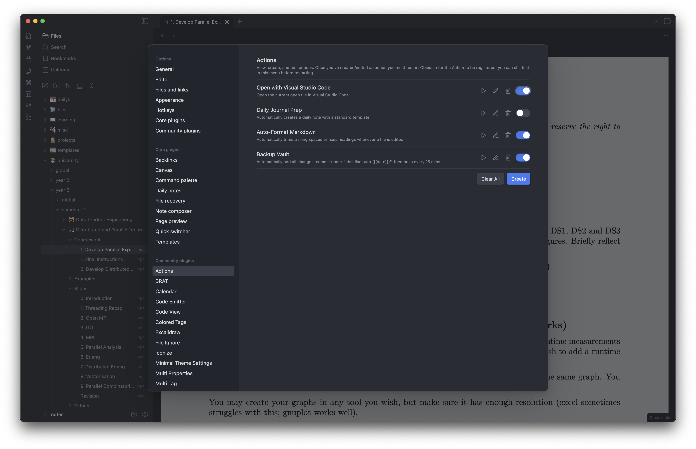

<p align="center">
  
</p>

<p align="center">
  <a href="https://obsidian.md">
    
  </a>
</p>

# Obsidian Actions

Obsidian Actions is a lightweight Obsidian plugin for small automations. Each
action has three parts:

- a trigger
- an execution type
- a code body

Use it to run commands, call scripts, show notices, or respond to Obsidian
events without building a full plugin. See documentation [here](https://www.mcmanussliam.com/docs/obsidian-actions).


## Install

### Community Plugin

Since this plugin isn't officially released in the Community Plugins store yet,
the easiest way to install it is with Obsidian [BRAT](https://obsidian.md/plugins?id=obsidian42-brat),
which lets you install plugins directly from GitHub.

After BRAT is enabled:

* Open Settings
* Go to BRAT
* Click Add Beta Plugin
  * You'll be asked for the plugin's GitHub repository URL. ([https://github.com/mcmanussliam/obsidian-actions](https://github.com/mcmanussliam/obsidian-actions))
* Install it

### Manual Install

Copy the plugin files into:

```text
<vault>/.obsidian/plugins/actions
```

Required files:

- `main.js`
- `styles.css`
- `manifest.json`

## Quick Start

1. Open `Settings -> Actions`.
2. Create a new action.
3. Choose a trigger.
4. Choose `js` or `shell`.
5. Write the code.
6. Restart Obsidian to register commands and hooks.

Start with a manual JavaScript action:

```javascript
new Notice("Action ran");
```

Suggested fields:

- `hook`: `manual`
- `type`: `js`
- `enabled`: `true`

## Triggers

| Hook | Behavior |
|---|---|
| `manual` | Runs when you trigger it from Obsidian |
| `startup` | Runs when the plugin loads |
| `interval` | Runs on a cron schedule |
| `createFile` | Runs when a file is created |
| `modifyFile` | Runs when a file is modified |
| `deleteFile` | Runs when a file is deleted |
| `renameFile` | Runs when a file is renamed |

## Execution Types

| Type | Use It For |
|---|---|
| `js` | Obsidian-aware automations that need app APIs, notices, or editor context |
| `shell` | Existing scripts, CLI tools, or system workflows |

Available JavaScript helpers include:

- `app`
- `vault`
- `workspace`
- `metadataCache`
- `fileManager`
- `Notice`
- `Modal`
- `Setting`
- `FuzzySuggestModal`
- `exec`

## Runtime Variables

Before an action runs, the plugin renders its code with Mustache templates such
as `{{file_name}}` or `{{path}}`.

Available variables include:

- `path`
- `relative_path`
- `extension`
- `selected`
- `word_count`
- `vault_name`
- `file_name`
- `file_name_with_ext`
- `content`
- `timestamp`
- `date`
- `time`

Example:

```bash
echo "Processing {{{file_name_with_ext}}} at {{time}}"
```

## Compatibility

| Type | Desktop | Mobile |
|---|---|---|
| `js` | Supported | Depends on the APIs and code you use |
| `shell` | Supported where Obsidian can execute local shell commands | Not reliable on mobile |

`shell` actions are best suited to desktop environments with access to local
scripts, binaries, and a usable shell environment.

## Examples

Open the current file in VS Code:

```bash
/path/to/code "{{{path}}}"
```

Show the current file in a notice:

```javascript
new Notice(`Current file: {{{file_name_with_ext}}}`);
```

Run a backup script on a schedule:

```bash
/absolute/path/to/backup-vault.sh
```
